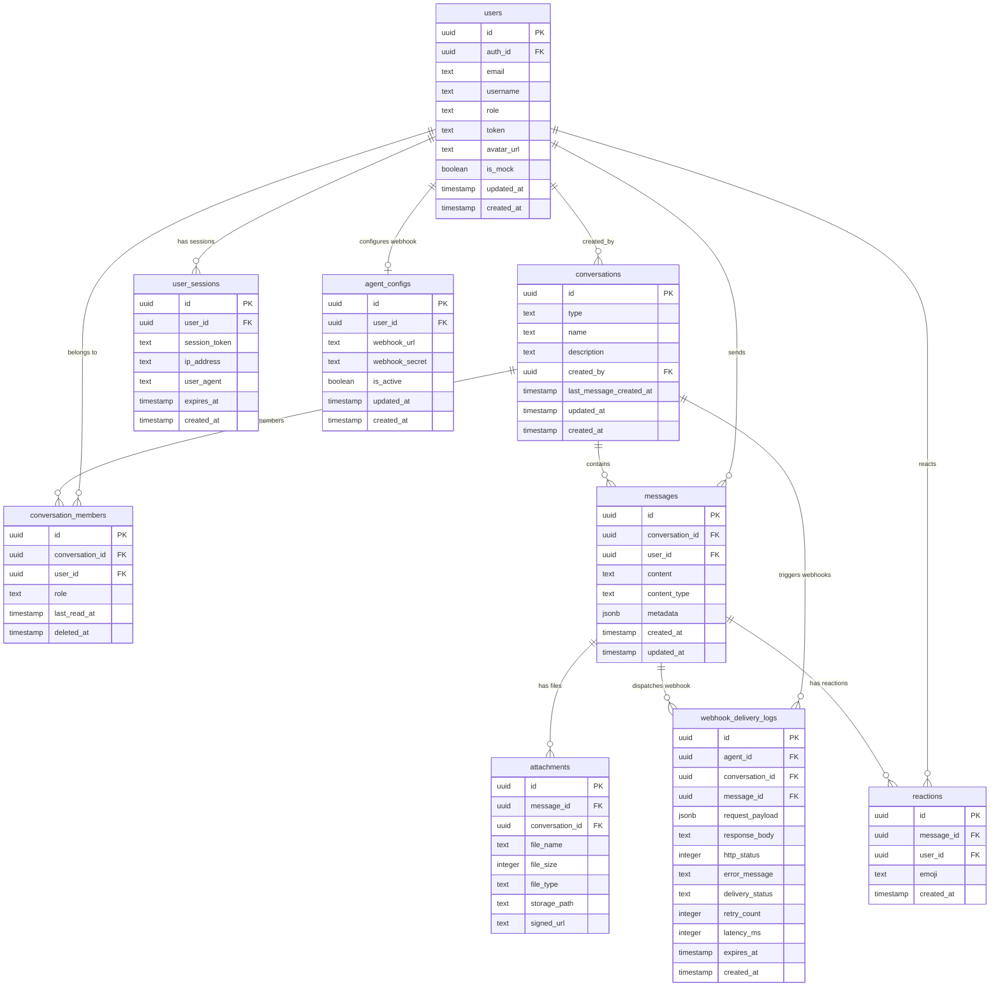

# Database Detailed Design

**Project:** Agent Playground Mobile
**Version:** 0.1.0
**Date:** 2026-03-17
**Note:** Schema is **existing** — shared Supabase PostgreSQL instance with the web app. No new tables or migrations required. This document maps the existing schema for mobile client consumption.

---

## 1. ER Diagram



---

## 2. Table Definitions

### E-01: Users (`users`)

| Column | Type | Constraints | Description |
|--------|------|-------------|-------------|
| id | uuid | PK, default gen_random_uuid() | Unique user ID |
| auth_id | uuid | FK -> auth.users, unique | Supabase Auth user reference |
| email | text | nullable | User email (optional) |
| username | text | unique, not null | Display name |
| role | text | not null, check in ('admin','user','agent') | User role enum |
| token | text | unique, not null | 64-char pre-provisioned login token |
| avatar_url | text | nullable | Supabase Storage path to avatar |
| is_mock | boolean | default false | Test/seed data flag |
| updated_at | timestamptz | default now() | Last update timestamp |
| created_at | timestamptz | default now() | Creation timestamp |

**RLS Policies:**
- SELECT: All authenticated users can see all users (username, avatar, role)
- SELECT (token): Only own token visible (user_id = auth.uid())
- INSERT/UPDATE/DELETE: Admin role only

**Indexes:**
- `idx_users_token` on `token` (login lookup)
- `idx_users_role` on `role` (agent filtering)
- `idx_users_username` on `username` (search)

**Mobile Usage:**
- Phase 1: Login (token lookup), conversation display (username, avatar)
- Phase 3: Admin user list, create user

---

### E-02: Conversations (`conversations`)

| Column | Type | Constraints | Description |
|--------|------|-------------|-------------|
| id | uuid | PK, default gen_random_uuid() | Unique conversation ID |
| type | text | not null, check in ('dm','group') | DM or group conversation |
| name | text | nullable | Group name (null for DM) |
| description | text | nullable | Group description |
| created_by | uuid | FK -> users.id | Creator user |
| last_message_created_at | timestamptz | nullable | Updated by trigger on message INSERT |
| updated_at | timestamptz | default now() | Last update |
| created_at | timestamptz | default now() | Creation |

**RLS Policies:**
- SELECT/INSERT/UPDATE: Only conversation members (via conversation_members join)

**Indexes:**
- `idx_conversations_last_message` on `last_message_created_at DESC` (sort by recent)
- `idx_conversations_type` on `type` (filter DM vs group)

**Triggers:**
- `update_last_message_at`: On messages INSERT, updates `last_message_created_at`

**Mobile Usage:**
- Phase 1: Conversation list sorted by recent, DM/group type routing

---

### E-03: Conversation Members (`conversation_members`)

| Column | Type | Constraints | Description |
|--------|------|-------------|-------------|
| id | uuid | PK, default gen_random_uuid() | Row ID |
| conversation_id | uuid | FK -> conversations.id, not null | Parent conversation |
| user_id | uuid | FK -> users.id, not null | Member user |
| role | text | default 'member', check in ('admin','member') | Member role in conversation |
| last_read_at | timestamptz | nullable | Last read timestamp for unread calculation |
| deleted_at | timestamptz | nullable | Soft delete (left conversation) |

**RLS Policies:**
- SELECT: Own membership records
- UPDATE (last_read_at): Own record only

**Indexes:**
- `idx_cm_conversation_user` unique on `(conversation_id, user_id)` where `deleted_at IS NULL`
- `idx_cm_user` on `user_id` (find user's conversations)

**Mobile Usage:**
- Phase 1: Determine which conversations user belongs to
- Phase 2: Unread count calculation (messages.created_at > last_read_at), member list

---

### E-04: Messages (`messages`)

| Column | Type | Constraints | Description |
|--------|------|-------------|-------------|
| id | uuid | PK, default gen_random_uuid() | Message ID |
| conversation_id | uuid | FK -> conversations.id, not null | Parent conversation |
| user_id | uuid | FK -> users.id, not null | Sender |
| content | text | not null | Message text (markdown supported) |
| content_type | text | default 'text', check in ('text','file','image','url') | Content type |
| metadata | jsonb | nullable | Extra data (image_url, file_info, url_preview) |
| created_at | timestamptz | default now() | Send timestamp |
| updated_at | timestamptz | default now() | Edit timestamp |

**RLS Policies:**
- SELECT: Conversation members only
- INSERT: Conversation members only, user_id must match auth.uid()

**Indexes:**
- `idx_messages_conversation_created` on `(conversation_id, created_at DESC)` (paginated fetch)
- `idx_messages_user` on `user_id` (sender lookup)

**Metadata Schema:**
```jsonb
-- content_type = 'image'
{ "image_url": "https://storage.../image.jpg" }

-- content_type = 'file'
{ "file_name": "doc.pdf", "file_size": 1024000, "file_type": "application/pdf" }

-- content_type = 'url'
{ "url_preview": { "title": "...", "description": "...", "image": "..." } }
```

**Mobile Usage:**
- Phase 1: Send/receive messages, pagination, realtime subscription
- Phase 2: File/image message types

---

### E-05: Attachments (`attachments`)

| Column | Type | Constraints | Description |
|--------|------|-------------|-------------|
| id | uuid | PK, default gen_random_uuid() | Attachment ID |
| message_id | uuid | FK -> messages.id, not null | Parent message |
| conversation_id | uuid | FK -> conversations.id, not null | Scoping for RLS |
| file_name | text | not null | Original filename |
| file_size | integer | not null, check > 0 and <= 10485760 | Size in bytes (max 10MB) |
| file_type | text | not null | MIME type |
| storage_path | text | not null | Supabase Storage path: `attachments/{convId}/{msgId}/{filename}` |
| signed_url | text | nullable | Temporary signed URL (1h expiry) |

**RLS Policies:**
- SELECT: Conversation members only (via conversation_id)
- INSERT: Conversation members only

**Mobile Usage:**
- Phase 2: File upload, image preview, download

---

### E-06: Reactions (`reactions`)

| Column | Type | Constraints | Description |
|--------|------|-------------|-------------|
| id | uuid | PK, default gen_random_uuid() | Reaction ID |
| message_id | uuid | FK -> messages.id, not null | Target message |
| user_id | uuid | FK -> users.id, not null | Reactor |
| emoji | text | not null | Unicode emoji (typically "heart") |
| created_at | timestamptz | default now() | When reacted |

**Constraints:**
- UNIQUE on `(message_id, user_id)` — one reaction per user per message

**RLS Policies:**
- SELECT: Conversation members (via message -> conversation)
- INSERT/DELETE: Own reactions only (user_id = auth.uid())

**Mobile Usage:**
- Phase 2: Long-press to react, toggle own reaction, display count

---

### E-07: Agent Configs (`agent_configs`)

| Column | Type | Constraints | Description |
|--------|------|-------------|-------------|
| id | uuid | PK, default gen_random_uuid() | Config ID |
| user_id | uuid | FK -> users.id, unique, not null | Agent user (must have role='agent') |
| webhook_url | text | not null | HTTPS endpoint for webhook delivery |
| webhook_secret | text | not null | Shared secret for HMAC-SHA256 |
| is_active | boolean | default true | Enable/disable webhook |
| updated_at | timestamptz | default now() | Last update |
| created_at | timestamptz | default now() | Creation |

**RLS Policies:**
- SELECT: Admin or own record (agent user)

**Mobile Usage:**
- Phase 3: Admin views agent webhook status (read-only on mobile)

---

### E-08: Webhook Delivery Logs (`webhook_delivery_logs`)

| Column | Type | Constraints | Description |
|--------|------|-------------|-------------|
| id | uuid | PK, default gen_random_uuid() | Log ID |
| agent_id | uuid | FK -> users.id, not null | Target agent |
| conversation_id | uuid | FK -> conversations.id, not null | Source conversation |
| message_id | uuid | FK -> messages.id, not null | Triggering message |
| request_payload | jsonb | not null | Full webhook payload sent |
| response_body | text | nullable | Agent's response |
| http_status | integer | nullable | Response HTTP status |
| error_message | text | nullable | Error details if failed |
| delivery_status | text | not null, check in ('pending','delivered','failed') | Current status |
| retry_count | integer | default 0 | Number of delivery attempts |
| latency_ms | integer | nullable | Request duration in milliseconds |
| expires_at | timestamptz | not null | Auto-delete after 30 days |
| created_at | timestamptz | default now() | When dispatched |

**RLS Policies:**
- SELECT: Admin only

**Indexes:**
- `idx_wdl_agent_created` on `(agent_id, created_at DESC)` (filter by agent)
- `idx_wdl_status` on `delivery_status` (filter by status)
- `idx_wdl_expires` on `expires_at` (TTL cleanup)

**Mobile Usage:**
- Phase 3: Admin webhook log viewer, filter by agent/status/date
- Phase 3: Agent thinking indicator (check pending status for conversation)

---

### E-09: User Sessions (`user_sessions`)

| Column | Type | Constraints | Description |
|--------|------|-------------|-------------|
| id | uuid | PK, default gen_random_uuid() | Session ID |
| user_id | uuid | FK -> users.id, not null | Session owner |
| session_token | text | not null | JWT or session identifier |
| ip_address | text | nullable | Client IP for audit |
| user_agent | text | nullable | Device/browser info |
| expires_at | timestamptz | not null | Session expiry (24h TTL) |
| created_at | timestamptz | default now() | Session start |

**RLS Policies:**
- SELECT: Own session only

**Mobile Usage:**
- Phase 1: Session validation, presence tracking

---

## 3. Supabase Storage Buckets

| Bucket | Access | Max Size | Path Pattern |
|--------|--------|----------|--------------|
| `attachments` | Authenticated (RLS via conversation membership) | 10MB per file | `attachments/{conversationId}/{messageId}/{filename}` |
| `avatars` | Public read, authenticated write | 2MB per file | `avatars/{userId}/{filename}` |

**Signed URLs:** Generated server-side, 1-hour expiry. Mobile client requests signed URL via Storage API before download.

---

## 4. Realtime Channel Configuration

| Channel Pattern | Type | Payload | Mobile Subscription |
|----------------|------|---------|---------------------|
| `public:messages:conversation_id=eq.{id}` | postgres_changes (INSERT) | Full message row + sender join | Phase 1: Subscribe on chat screen open, unsubscribe on leave |
| `presence:{conversationId}` | presence | `{ user_id, online_at }` | Phase 2: Track/sync on conversation list |
| `typing:{conversationId}` | broadcast | `{ user_id, username }` | Phase 2: Send on keystroke (3s debounce), listen on chat screen |

---

## 5. Data Access Patterns (Mobile-Specific)

### Conversation List Query (S-02)
```sql
SELECT c.*,
  cm.last_read_at,
  (SELECT count(*) FROM messages m
   WHERE m.conversation_id = c.id
   AND m.created_at > COALESCE(cm.last_read_at, '1970-01-01')) as unread_count,
  (SELECT json_build_object('content', m.content, 'user_id', m.user_id, 'created_at', m.created_at)
   FROM messages m WHERE m.conversation_id = c.id
   ORDER BY m.created_at DESC LIMIT 1) as last_message
FROM conversations c
JOIN conversation_members cm ON cm.conversation_id = c.id
WHERE cm.user_id = auth.uid() AND cm.deleted_at IS NULL
ORDER BY c.last_message_created_at DESC NULLS LAST
LIMIT 50;
```

### Message Pagination Query (S-03/S-04)
```sql
SELECT m.*,
  json_build_object('id', u.id, 'username', u.username, 'avatar_url', u.avatar_url, 'role', u.role) as sender,
  COALESCE(
    (SELECT json_agg(json_build_object('emoji', r.emoji, 'user_id', r.user_id))
     FROM reactions r WHERE r.message_id = m.id), '[]'
  ) as reactions
FROM messages m
JOIN users u ON u.id = m.user_id
WHERE m.conversation_id = :conversationId
  AND m.created_at < :cursor  -- pagination cursor
ORDER BY m.created_at DESC
LIMIT 30;
```

### Webhook Logs Query (S-06, Admin)
```sql
SELECT wdl.*,
  json_build_object('id', u.id, 'username', u.username) as agent,
  json_build_object('id', c.id, 'name', c.name) as conversation
FROM webhook_delivery_logs wdl
JOIN users u ON u.id = wdl.agent_id
JOIN conversations c ON c.id = wdl.conversation_id
WHERE (:agentFilter IS NULL OR wdl.agent_id = :agentFilter)
  AND (:statusFilter IS NULL OR wdl.delivery_status = :statusFilter)
  AND wdl.created_at >= :dateFrom
ORDER BY wdl.created_at DESC
LIMIT 50;
```

---

## 6. Traceability Matrix

| Entity | FR References | Screen References |
|--------|--------------|-------------------|
| E-01 users | FR-01, FR-02, FR-20, FR-21 | S-01, S-02, S-03, S-04, S-05 |
| E-02 conversations | FR-03, FR-04, FR-05, FR-10 | S-02, S-03, S-04, S-08 |
| E-03 conversation_members | FR-03, FR-04, FR-11, FR-17 | S-02, S-04, S-08 |
| E-04 messages | FR-05, FR-06, FR-07, FR-08, FR-09 | S-03, S-04 |
| E-05 attachments | FR-12, FR-13 | S-03, S-04, S-07, S-08 |
| E-06 reactions | FR-15 | S-03, S-04 |
| E-07 agent_configs | FR-19, FR-22 | S-06 |
| E-08 webhook_delivery_logs | FR-19, FR-22 | S-06 |
| E-09 user_sessions | FR-02, FR-16 | S-01, S-02 |
